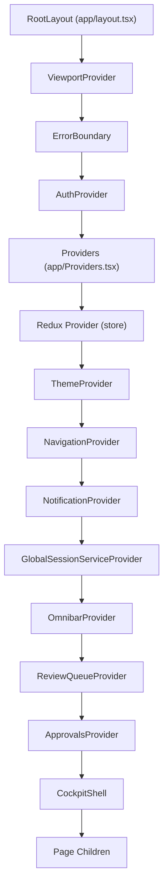
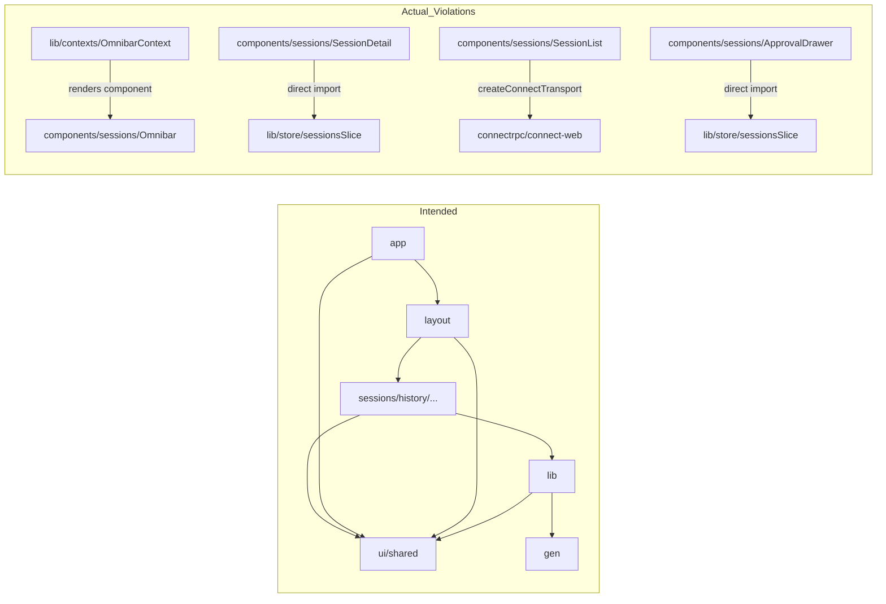
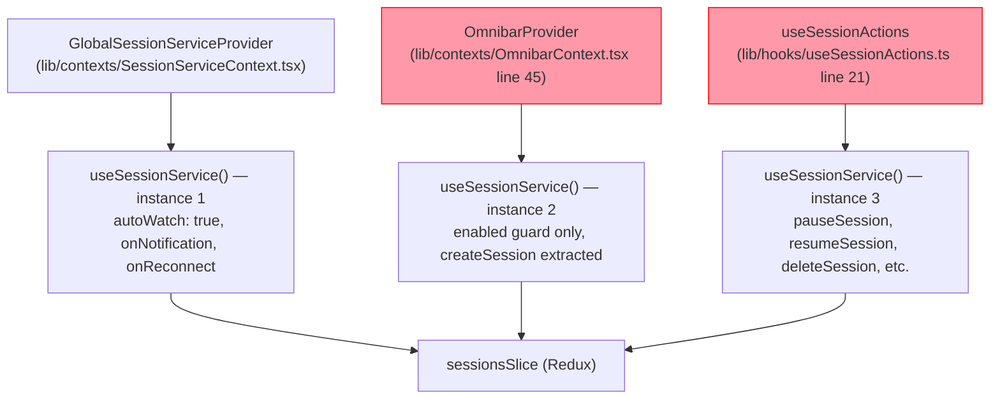

# Frontend Architecture Audit 2026

> Generated: 2026-05-08 | Branch: stapler-squad-frontend-refactor | Scope: `web-app/src/`
> Methodology: Read-only static analysis of source files. Every claim below is verified against the live codebase.

---

## Executive Summary

- **Sessions state is instantiated three times simultaneously** — `SessionServiceContext`, `OmnibarContext`, and `useSessionActions` each call `useSessionService()` independently, all writing to the same Redux slice. This is wasteful and risks initialization races.
- **Double approval polling** — `ApprovalsContext` and `useApprovals` both start independent 5-second RTK Query polling loops. When `ApprovalNavBadge` and `ApprovalPanel` are both mounted, the same endpoint is polled twice every 5 seconds.
- **`CockpitActionsContext` is a 20-slot prop bag, not a context** — it was created to solve prop-drilling but has become the same problem at a higher level, threading 20 callbacks through `CockpitShell` → `SessionList` → `SessionCard`.
- **85 inline `createConnectTransport` call sites** across hooks and components — no shared transport or client factory. Any auth, interceptor, or base-URL change must be replicated across all 85 sites.
- **3 hardcoded-hex violations** in production CSS files and 11 in a debug page; `vars.*` token enforcement covers JSX `style` props but not `.css.ts` files.

**Domain health ratings:**

| Domain | Grade | Key Finding |
|--------|-------|-------------|
| State Management | C | Triple `useSessionService` + double approvals polling |
| Data Fetching | C | 85 ad-hoc transports, 3 error-handling patterns |
| CSS / Styling | B | 2 non-compliant production files; tooling gap in `.css.ts` |
| Component Structure | C | 7 components >800 LOC in one directory; 22-prop `SessionCard` |

---

## Table of Contents

1. [Architecture Overview](#1-architecture-overview)
2. [Pattern Inventory](#2-pattern-inventory)
   - [2.1 State Management Patterns](#21-state-management-patterns)
   - [2.2 Data Fetching Patterns](#22-data-fetching-patterns)
   - [2.3 CSS / Styling Patterns](#23-css--styling-patterns)
   - [2.4 Component Structure Patterns](#24-component-structure-patterns)
3. [Duplication Map](#3-duplication-map)
4. [Consolidation Opportunities](#4-consolidation-opportunities)
5. [Tooling Recommendations](#5-tooling-recommendations)
6. [Architecture Boundary Violations](#6-architecture-boundary-violations)
7. [Recommended Action Roadmap](#7-recommended-action-roadmap)
8. [ADR Candidates](#8-adr-candidates)

---

## 1. Architecture Overview

### Layer Model

The codebase has five named layers enforced by `eslint-plugin-boundaries` (config at `web-app/.eslintrc.json`):

| Layer | Path Pattern | Allowed Imports |
|-------|-------------|-----------------|
| `app` | `src/app/**` | all layers |
| `layout` | `src/components/layout/**` | providers, sessions, history, logs, settings, telemetry, ui, shared, lib, gen |
| `providers` | `src/components/providers/**` | ui, shared, lib, gen |
| `sessions` / `history` / `logs` / `settings` / `telemetry` / `unfinished` | `src/components/<domain>/**` | providers, ui, shared, lib, gen |
| `ui` | `src/components/ui/**` | lib, gen |
| `shared` | `src/components/shared/**` | lib, gen |
| `lib` | `src/lib/**` | **ui, sessions**, gen ← violation risk |
| `gen` | `src/gen/**` | none |

The `lib` → `sessions` allow-rule is the notable design choice: `lib/contexts/OmnibarContext.tsx` imports and renders `@/components/sessions/Omnibar` inside the provider body. This is legal under the current boundaries config but creates tight coupling between a library-layer context and a component-layer component (see Section 6).

### Provider Hierarchy

The full provider chain wrapping every page, verified against `web-app/src/app/layout.tsx` and `web-app/src/app/Providers.tsx`:



**Provider depth:** 14 levels from `RootLayout` to page content. Every page renders inside all 9 global contexts before rendering any page-specific content.

### Key Metrics

| Metric | Value |
|--------|-------|
| Total source files (`web-app/src/`, excl. `gen/`) | 375 |
| `.css.ts` files | 115 |
| Hooks in `lib/hooks/` | 46 |
| Context files in `lib/contexts/` | 9 providers + 1 test |
| Redux slices | 3 (`sessionsSlice`, `reviewQueueSlice`, `bulkSelectionSlice`) |
| Components >800 LOC | 7 (all in `components/sessions/`) |
| `createConnectTransport` call sites | 85 (across hooks + components) |

---

## 2. Pattern Inventory

### 2.1 State Management Patterns

Six distinct state management patterns are in active use:

#### Pattern SM-1: Global Provider + Redux Slice (Canonical)

The intended pattern: a provider-level hook dispatches to a Redux slice; components consume via the context accessor.

**Examples:**
- `lib/contexts/SessionServiceContext.tsx` (94 lines) wraps `useSessionService` which dispatches to `sessionsSlice`. Consumers call `useSessionServiceContext()`.
- `lib/contexts/ReviewQueueContext.tsx` (19 lines) wraps `useReviewQueue` which dispatches to `reviewQueueSlice`. Consumers call `useReviewQueueContext()`.

**Verdict:** Canonical. The clean separation (provider owns the hook instantiation; slice owns state) is the right model. The problem is violations of this pattern elsewhere.

#### Pattern SM-2: Global Provider + RTK Query Polling (Tolerated)

Provider calls an RTK Query hook directly, bypassing Redux dispatch.

**Examples:**
- `lib/contexts/ApprovalsContext.tsx` (67 lines): calls `useGetApprovalsQuery(undefined, { pollingInterval: 5000 })`. State lives in RTK Query's normalized cache, not a named slice.

**Verdict:** Tolerated. RTK Query for polling is reasonable, but the parallel `useApprovals` hook (Pattern SM-4) creates double polling.

#### Pattern SM-3: Local Scoped Context (Canonical for sub-trees)

Context scoped to a component sub-tree rather than the app root.

**Examples:**
- `lib/contexts/SessionVcsContext.tsx` (37 lines) — wraps VCS state for one session; mounted by `SessionDetail`. Only VCS-consuming children see it.
- `lib/contexts/CockpitActionsContext.ts` (39 lines) — mounted by `CockpitShell`; scoped to cockpit children.

**Verdict:** Canonical pattern for sub-tree state. However, `CockpitActionsContext` has grown to a 20-slot callback bag (see Pattern SM-5).

#### Pattern SM-4: Direct Hook Usage Without Context Wrapper (Violation)

A hook that calls the same data source as a context is used directly in components, bypassing the context.

**Examples:**
- `useApprovals` hook (`lib/hooks/useApprovals.ts`, 103 lines) is consumed directly by `ApprovalPanel.tsx` and `ApprovalDrawer.tsx`, while `ApprovalsContext` (Pattern SM-2) provides the same data to `ApprovalNavBadge`. Both call `useGetApprovalsQuery` independently.
- `OmnibarContext.tsx` line 45: `const { createSession } = useSessionService({ enabled: ... })` — second independent instantiation of the primary session hook, used solely to extract `createSession`. The full session state from this instance is discarded.

**Verdict:** Violation. These create redundant polling loops and hook initializations.

#### Pattern SM-5: Prop-Drilling Proxy Context (Anti-pattern)

A context whose value is a flat bag of 20+ callbacks, functioning as a renamed prop object rather than true shared state.

**Examples:**
- `lib/contexts/CockpitActionsContext.ts` — the `CockpitActions` interface has 20 named slots:

```typescript
export interface CockpitActions {
  sessions: Session[];
  loading: boolean;
  error: Error | null;
  onSessionClick: (session: Session) => void;
  onDeleteSession: (sessionId: string) => Promise<void> | void;
  onPauseSession: (sessionId: string) => void;
  onResumeSession: (session: Session) => void;
  onDirectResumeSession: (session: Session) => void;
  onCloneSession: (sessionId: string) => void;
  onNewWorkspaceSession: (sessionId: string) => void;
  onRenameSession: (sessionId: string, newTitle: string) => Promise<boolean>;
  onRestartSession: (sessionId: string) => Promise<boolean>;
  onUpdateTags: (sessionId: string, tags: string[]) => void;
  onNewSession: () => void;
  onCreateCheckpoint: (sessionId: string, label: string) => Promise<boolean>;
  onListCheckpoints: (sessionId: string) => Promise<CheckpointProto[]>;
  onForkFromCheckpoint: (...) => Promise<Session | null>;
  onRunOneShot: (sessionId: string) => Promise<void>;
  onSetRateLimitEnabled: (sessionId: string, enabled: boolean) => void;
  onClearConversationState: (sessionId: string) => Promise<boolean>;
  onListSessions: () => void;
}
```

**Verdict:** Anti-pattern. This is prop-drilling by another name. The 20 session action callbacks are already available via `useSessionServiceContext()` directly.

#### Pattern SM-6: Direct Redux Selector in Component (Violation)

A component calls `useAppSelector` directly rather than going through a context.

**Examples:**
- `components/sessions/SessionDetail.tsx` line 20: `import { useAppSelector } from "@/lib/store"` and line 21: `import { selectAllSessions } from "@/lib/store/sessionsSlice"` — the component bypasses `SessionServiceContext` to read session state directly from Redux.
- `components/sessions/ApprovalDrawer.tsx` lines 5–6: same pattern — imports `useAppSelector` and `selectAllSessions` directly.

**Verdict:** Violation. Direct Redux coupling in components breaks the context abstraction layer and makes the component harder to test in isolation.

#### Pattern SM-7: localStorage-Persisted Context (Special-purpose, Canonical)

A context that hydrates from `localStorage` on mount and persists state changes back.

**Examples:**
- `lib/contexts/NavigationContext.tsx` (110 lines): stores `isDrawerOpen` in `localStorage` with key `nav-drawer-open`. Handles hydration mismatch and breakpoint-based auto-close.

**Verdict:** Canonical for this specific use case (persistent UI state). Not appropriate for data state.

---

### 2.2 Data Fetching Patterns

Five distinct patterns are in use across 46 hooks in `lib/hooks/`:

#### Pattern DF-A: Redux-Backed ConnectRPC Streaming (Canonical)

Primary data hub for session state. Creates a `createWatchTransport` (WebSocket-based) client, dispatches all state changes to a Redux slice, and wraps a reconnect loop.

**Key files:**
- `lib/hooks/useSessionService.ts` (646 lines) — the canonical example
- `lib/hooks/useReviewQueue.ts` (419 lines) — same pattern for review queue

**Error handling:** Every `catch` block calls `dispatch(setError(error.message))`, storing a serialized string in Redux. Consumers reconstruct `Error | null` from the string selector:

```typescript
// From useSessionService.ts lines 130–133
} catch (err) {
  const error = err instanceof Error ? err : new Error("Failed to list sessions");
  dispatch(setError(error.message));
}
```

**Loading state:** Global `sessions.loading` flag — no per-operation granularity. Subsequent calls do not reset loading unless the Redux state transitions explicitly.

**Verdict:** Canonical for streaming/real-time data. The error serialization (string → Redux → reconstructed Error) is unnecessarily lossy; a typed error shape would be better.

#### Pattern DF-B: RTK Query Polling (Tolerated for periodic data)

Uses RTK Query's built-in `pollingInterval` for simple CRUD-style endpoints.

**Key files:**
- `lib/hooks/useApprovals.ts` (103 lines): `useGetApprovalsQuery(undefined, { pollingInterval: pollInterval })`
- `lib/contexts/ApprovalsContext.tsx` (67 lines): same call, duplicated

**Error handling:** RTK Query error shape manually converted to `Error | null` via `useMemo`:

```typescript
// From useApprovals.ts lines 86–93
const error = useMemo(() => {
  if (!queryError) return null;
  const msg =
    typeof queryError === "object" && "error" in queryError
      ? String((queryError as { error: unknown }).error)
      : "Unknown error";
  return new Error(msg);
}, [queryError]);
```

`ApprovalsContext.tsx` duplicates this conversion inline (lines 39–45) without a `useMemo`.

**Verdict:** Tolerated, but the duplication of the same hook in both a hook file and a context file is the core problem (see Section 3).

#### Pattern DF-C: Ad-hoc ConnectRPC Client Per Hook (Violation)

Each hook independently calls `createConnectTransport` and `createClient`. There are **85 call sites** of `createConnectTransport` across `lib/hooks/` (42 calls) and `components/` (components creating their own transports is an additional violation of layer separation).

**Key files (hooks layer):**
- `lib/hooks/useBranchSuggestions.ts` line 41: `createConnectTransport({ baseUrl })`
- `lib/hooks/useSessionVcs.ts` line 55: `createClient(SessionService, createConnectTransport(...))`
- `lib/hooks/useVcsStatus.ts` line 5: `import { createConnectTransport }` with own transport created per call
- `lib/hooks/useFileService.ts` line 33: `createClient(SessionService, createConnectTransport({ baseUrl }))`
- Same pattern in: `useApprovalAnalytics`, `useApprovalRules`, `useAuditLog`, `useDatabase`, `useBrowserLogStream`, `useHistoryFullTextSearch`, `useNotificationHistory`, `usePathCompletions`, `useRepositorySuggestions`, `useWorktreeSuggestions`

**Components also creating transports (layer violation):**
- `components/sessions/SessionWizard.tsx` line 8+133
- `components/sessions/OmnibarCreationPanel.tsx` line 7+167
- `components/sessions/SessionList.tsx` line 5+198
- `components/sessions/SessionLogsTab.tsx` line 5+42
- `components/errors/ErrorDashboard.tsx` line 6+25

**Error handling:** Silent. Most of these hooks return empty arrays on failure with no exposed error state (e.g., `usePathCompletions` returns `[]` on error).

**Verdict:** Violation. No interceptors (auth, timing) are attached to these transports. The main `useSessionService` transport includes `createAuthInterceptor()` and `createRpcTimingInterceptor()`; all ad-hoc transports skip these.

#### Pattern DF-D: WebSocket Streaming with Custom Transport (Canonical for streaming)

Uses `createWatchTransport` (project-specific WebSocket transport wrapper) for streaming RPCs.

**Key files:**
- `lib/hooks/useTerminalStream.ts` (13.4K)
- `lib/hooks/useTerminalSnapshot.ts` (3.8K)
- `lib/hooks/useLiveTail.ts` (4.3K)

**Error handling:** Varies — terminal hooks expose connection-state-based error indicators rather than the standard `{ loading, error }` shape.

**Verdict:** Canonical for streaming. No duplication issues.

#### Pattern DF-E: Local Pagination via useState + loadMore (Tolerated)

Manages pagination state locally with `useState` and a `loadMore` callback. No shared abstraction.

**Key files:**
- `lib/hooks/useNotificationHistory.ts` (6.1K)
- `lib/hooks/useSearchHistory.ts` (2.5K)
- `lib/hooks/usePathHistory.ts` (2.9K)

**Error handling:** Varies per hook.

**Verdict:** Tolerated but unstructured. Three independent implementations of the same cursor/page pattern.

**Error Handling Patterns — Side-by-Side:**

| Pattern | Error source | Storage | Consumer shape |
|---------|-------------|---------|----------------|
| DF-A (Redux streaming) | `catch(err)` | `dispatch(setError(err.message))` — string in Redux | `error: useAppSelector(selectSessionsError) ? new Error(str) : null` |
| DF-B (RTK Query) | RTK Query `error` field | RTK Query cache | `useMemo` or inline conversion to `Error \| null` |
| DF-C (ad-hoc direct) | `catch` → silent | none (returns `[]` or `null`) | callers have no error state |

---

### 2.3 CSS / Styling Patterns

**Token contract:** `web-app/src/styles/theme-contract.css.ts` (161 lines) defines the full design token contract via `createThemeContract`. Token groups: color (54 tokens across text, surfaces, borders, action, status, accent, inputs, terminal, cyberpunk), statusBadge (15 tokens), font (3), space (9 scale steps), radii (4), fontSize (5), fontWeight (4), shadow (4). Total: ~95 tokens.

**`breakpoints` and `zIndex`** are intentionally exported as plain constants (not tokens) because CSS custom properties cannot be used in `@media` queries. This is documented at lines 140–161 of `theme-contract.css.ts`.

**Theme implementation:** `web-app/src/styles/theme.css.ts` (619 lines) implements six themes (matrix, cyberpunk77, wh40k, clean, light, dark) via `createTheme`. Terminal tokens are hardcoded to dark values in all themes (e.g., `terminalBackground: "#1e1e1e"`) — this is intentional and not a violation.

#### Compliance Tiers

**Tier 1 — Fully Compliant (estimated ~90 files):** Uses `vars.*` tokens throughout, uses `recipe()` for variants. Example: `components/ui/ActionBar.css.ts`, `components/ui/Modal.css.ts`. These are the canonical ADR-009 pattern.

**Tier 2 — Partially Compliant (estimated ~20 files):** Mixes `vars.*` tokens with hardcoded `px` dimension values. The `vars.space` token only covers 9 scale steps (0–16). Values like `"320px"` (column widths), `"48px"` (icon sizes), `"24px"` (common spacing) appear in:
- `components/sessions/SessionCard.css.ts` (808 lines) — most hardcoded `px` values
- `components/sessions/SessionDetail.css.ts` (607 lines)
- `components/ui/NotificationPanel.css.ts` (710 lines)

**Tier 3 — Non-Compliant (2 files with production violations):**

1. **`components/sessions/ApprovalAnalyticsPanel.css.ts`** (437 lines) — hardcoded hex on lines 300, 315, 320:
   ```typescript
   // line 300
   export const barTool = style({ background: "#8b5cf6", opacity: 0.7 });
   // line 315
   export const barPython = style({ background: "#3b82f6", opacity: 0.7 });
   // line 320
   export const barGap = style({ background: "#f97316", opacity: 0.8 });
   ```
   No corresponding chart color tokens exist in `theme-contract.css.ts`.

2. **`app/debug/escape-codes/page.css.ts`** — 11 escape-code type badges with direct hex on lines 189–199:
   ```typescript
   export const badgeCSI = style({ background: "#3b82f6", color: "white" });
   export const badgeOSC = style({ background: "#8b5cf6", color: "white" });
   export const badgeDCS = style({ background: "#ec4899", color: "white" });
   // ... 8 more
   ```

**Tier 4 — Intentional Override (1 file, documented):**

`components/layout/Header.css.ts` lines 21–23 override two text tokens scoped to the dark header for WCAG AA contrast. This is a documented WCAG fix, not a token gap:
```typescript
vars: {
  [vars.color.textPrimary]: "#ededed",
  [vars.color.textSecondary]: "#b4b4b4",
},
```

**Token Gap:** The contract has no chart/analytics color tokens. Any future analytics components will face the same choice: hardcode or add tokens. Adding `vars.color.chartPurple`, `vars.color.chartBlue`, `vars.color.chartOrange` (3 tokens) would close the gap.

**Current ESLint enforcement gap:** The `no-restricted-syntax` rule in `.eslintrc.json` covers `JSXAttribute[name.name='style'] > ... > Literal[value=/^#.../]` (JSX inline styles) but NOT string literals inside `.css.ts` files. The Tier 3 violations would not be caught by current CI.

---

### 2.4 Component Structure Patterns

#### Top-10 Largest Components (Verified Line Counts)

| Rank | File | LOC | Pattern | Concerns Mixed |
|------|------|-----|---------|----------------|
| 1 | `components/sessions/TerminalOutput.tsx` | 1,275 | Feature | Terminal rendering, connection management, resize |
| 2 | `components/sessions/SessionCard.tsx` | 1,183 | Pure presentation | Presentation only; 22 props (19 callbacks) |
| 3 | `components/sessions/Omnibar.tsx` | 1,146 | Mixed | Form state, path detection, routing, render |
| 4 | `components/sessions/SessionDetail.tsx` | 1,132 | Mixed | Data fetch, local UI state, 6-tab layout |
| 5 | `components/sessions/SessionWizard.tsx` | 912 | Mixed | Form, data fetch, profile mgmt, render |
| 6 | `components/sessions/SessionList.tsx` | 903 | Mixed | Data fetch, filtering, sorting, grouping, render |
| 7 | `components/sessions/ReviewQueuePanel.tsx` | 848 | Mixed | Dual data fetch, filter, pagination, render |
| 8 | `components/sessions/OmnibarCreationPanel.tsx` | 725 | Mixed | Form state, transport creation, render |
| 9 | `components/sessions/FileTree.tsx` | 698 | Feature | File tree render + fetch |
| 10 | `app/config/page.tsx` | 697 | Mixed | Config fetch + full-page render |

Also notable: `lib/hooks/useSessionService.ts` (646 lines), `lib/terminal/StateApplicator.ts` (677 lines).

Seven of the top ten are in `components/sessions/`. Total for that directory's top 7: 8,124 lines.

#### Component Pattern Classification

**Pattern CP-1: Pure Presentation (receives all data as props)**

`SessionCard.tsx` (1,183 lines, 23 props): props interface lines 86–110 shows 3 data props (`session`, `reviewItem`, `detectedStatus`) and 20 callback props. All local state is UI-only (confirm dialogs, tag editor open state). The excessive prop count forces callers to know about every possible action even when only a subset applies.

**Pattern CP-2: Mixed Responsibility (data + logic + render in one file)**

`SessionDetail.tsx` (1,132 lines): imports `useSessionActions` (line 13), `SessionVcsProvider` (line 14), and directly imports `useAppSelector`/`selectAllSessions` from Redux (lines 20–21). Manages local UI state for active tab, fullscreen mode, modal states, and workspace switch modal. Renders a 6-tab layout (terminal, diff, vcs, logs, info, files) — all in one component.

`ReviewQueuePanel.tsx` (848 lines): consumes `useReviewQueueContext` and `useApprovalsContext` simultaneously, then renders the full queue with filtering, sorting, pagination, and approval actions.

`SessionList.tsx` (903 lines): calls `createConnectTransport` directly (line 198) in addition to consuming `useSessionServiceContext`. This is both a mixed-responsibility violation and a layer violation (component creating its own transport).

**Pattern CP-3: Feature Shell (routes context into sub-components)**

`CockpitShell` pattern: a shell component that owns context instantiation and passes it down via a context provider. This is the right pattern — the problem is that `CockpitActionsContext` has grown too large (Pattern SM-5).

**Pattern CP-4: Context-Component Coupling (Violation)**

`lib/contexts/OmnibarContext.tsx` (167 lines) imports `Omnibar` component (line 5: `import { Omnibar, OmnibarSessionData } from "@/components/sessions/Omnibar"`) and renders it directly inside the provider body (lines 153–163). The provider is in the `lib` layer; the component is in the `sessions` layer. While technically allowed by the current `eslint-plugin-boundaries` config (`lib` → `sessions` is permitted), it means the context cannot be tested without mounting the full `Omnibar` component tree.

#### Parallel Session Creation Paths

`SessionWizard.tsx` (912 lines) and `Omnibar.tsx` + `OmnibarCreationPanel.tsx` (1,871 lines combined) both implement session creation flows including session type selection and path input. `SessionWizard` is imported and actively rendered by `app/page.tsx` (lines 9 and 498), so it is not deprecated — it is an active parallel path. Both paths create their own `createConnectTransport` instances. Both handle the same session type selections (directory, new worktree, etc.) with overlapping form logic.

---

## 3. Duplication Map

| # | Instance | File A | File B | LOC Each | Duplicate LOC | Type | Impact |
|---|----------|--------|--------|----------|---------------|------|--------|
| D1 | NavBadge trio | `components/sessions/ApprovalNavBadge.tsx` (42 lines) | `components/sessions/ReviewQueueNavBadge.tsx` (52 lines) + `components/ui/NotificationsNavBadge.tsx` (27 lines) | ~20–52 each | ~35 | JSX pattern | Low (cosmetic) |
| D2 | `useApprovals` + `ApprovalsContext` | `lib/hooks/useApprovals.ts` (103 lines) | `lib/contexts/ApprovalsContext.tsx` (67 lines) | 103 / 67 | ~60 | Logic | High (double polling) |
| D3 | RTK Query error conversion | `lib/hooks/useApprovals.ts` lines 86–93 (`useMemo`) | `lib/contexts/ApprovalsContext.tsx` lines 39–45 (inline) | 8 / 7 | 7 | Logic pattern | Low (divergence risk) |
| D4 | `useSessionService` triple instantiation | `lib/contexts/SessionServiceContext.tsx` | `lib/contexts/OmnibarContext.tsx` (line 45) + `lib/hooks/useSessionActions.ts` (line 21) | 646 hook | N/A (3 instances) | Pattern | Medium (hook init cost) |
| D5 | `createConnectTransport` per hook | `lib/hooks/useBranchSuggestions.ts` (line 41) | `lib/hooks/useVcsStatus.ts`, `useFileService.ts`, `useApprovalRules.ts`, `useAuditLog.ts`, `useDatabase.ts`, `useBrowserLogStream.ts`, `useHistoryFullTextSearch.ts`, `useNotificationHistory.ts`, `usePathCompletions.ts`, `useRepositorySuggestions.ts`, `useWorktreeSuggestions.ts`, `useApprovalAnalytics.ts` | ~10 lines each | ~110 lines | Pattern | High (no auth interceptors) |
| D6 | Transport creation in components | `components/sessions/SessionWizard.tsx` (line 133) | `components/sessions/OmnibarCreationPanel.tsx` (line 167), `components/sessions/SessionList.tsx` (line 198), `components/sessions/SessionLogsTab.tsx` (line 42) | ~5 lines each | ~15 lines | Pattern + layer violation | High (layer violation) |
| D7 | `ApprovalPanel` / `ApprovalDrawer` approval render | `components/sessions/ApprovalPanel.tsx` (102 lines) | `components/sessions/ApprovalDrawer.tsx` (115 lines) | 102 / 115 | ~60 | JSX + logic | Medium |
| D8 | Parallel session creation forms | `components/sessions/SessionWizard.tsx` (912 lines) | `components/sessions/Omnibar.tsx` + `OmnibarCreationPanel.tsx` (1,871 lines) | 912 / 1871 | ~200 (path input, type selector) | JSX + logic | High (maintenance cost) |
| D9 | `{ loading, error }` return shape | `lib/hooks/useApprovals.ts`, `useReviewQueue.ts`, `useSessionVcs.ts`, `useVcsStatus.ts`, `useNotificationHistory.ts`, `useBranchSuggestions.ts`, `usePathCompletions.ts`, `useRepositorySuggestions.ts` | — (all ~8 hooks) | — | ~40 lines of boilerplate | Pattern | Low (divergence risk) |

**Note on D1 (NavBadge trio):** The three components are similar but not identical. `ApprovalNavBadge` renders a `<button>` element (clickable); `ReviewQueueNavBadge` renders a `<span>` with navigation logic and sound notifications; `NotificationsNavBadge` renders a `<span>` and imports CSS from `ReviewQueueNavBadge.css`. The structural pattern is shared but the components have diverged sufficiently that a naive merge would be lossy.

---

## 4. Consolidation Opportunities

Sorted by Priority (P1 first), then Risk (Low first within each priority tier).

---

### Opp 1 — Extract shared RTK Query error-conversion helper

**What:** A 7-line error conversion block that appears in `useApprovals.ts` and `ApprovalsContext.tsx`.

**Files affected:**
- `web-app/src/lib/hooks/useApprovals.ts` (lines 86–93)
- `web-app/src/lib/contexts/ApprovalsContext.tsx` (lines 39–45)

**Problem:** Identical logic exists in two files with slightly different wrapping (`useMemo` vs. inline). Any future hook using RTK Query will copy-paste a third version.

**Canonical form:** `lib/utils/rtkQueryError.ts` exporting `toErrorOrNull(queryError: unknown): Error | null`.

**Impact:** ~15 lines saved immediately; eliminates future drift risk.

**Risk:** Low — pure utility extraction, no state changes, no runtime behavior change.

**Priority:** P1

---

### Opp 2 — Unify NavBadge trio into a `<NavBadge>` primitive

**What:** `ApprovalNavBadge.tsx`, `ReviewQueueNavBadge.tsx`, and `NotificationsNavBadge.tsx` share identical badge rendering with different context hooks.

**Files affected:**
- `web-app/src/components/sessions/ApprovalNavBadge.tsx` (42 lines)
- `web-app/src/components/sessions/ReviewQueueNavBadge.tsx` (52 lines)
- `web-app/src/components/ui/NotificationsNavBadge.tsx` (27 lines)

**Problem:** Badge visual styling is duplicated across three files (two share CSS from `ReviewQueueNavBadge.css`). Sound notifications and navigation logic in `ReviewQueueNavBadge` complicate a simple merge.

**Canonical form:** A `<NavBadge count={n} element="button"|"span" />` primitive in `components/ui/` that callers wrap with their own context hook. Each badge file becomes a 5-line wrapper.

**Impact:** ~35 lines saved; enforces consistent badge appearance.

**Risk:** Low — pure presentational change; no registry dependency; must preserve distinct element types (`button` vs. `span`) and `ReviewQueueNavBadge`'s notification sound logic.

**Priority:** P1

---

### Opp 3 — Introduce shared `HookResult<T>` type

**What:** The `{ loading: boolean; error: Error | null }` return shape is constructed differently in ~8 hooks with no shared type.

**Files affected:** `lib/hooks/useApprovals.ts`, `useReviewQueue.ts`, `useSessionVcs.ts`, `useVcsStatus.ts`, `useNotificationHistory.ts`, `useBranchSuggestions.ts`, `usePathCompletions.ts`, `useRepositorySuggestions.ts`.

**Problem:** No shared type means structural divergence over time. Currently two hooks construct `error` differently (Pattern DF-A vs. DF-B); a third pattern (DF-C) returns no error at all.

**Canonical form:** `lib/types/hooks.ts` exporting `type AsyncResult<T> = { loading: boolean; error: Error | null; data: T }`. Hooks adopt the type; no runtime change.

**Impact:** ~0 LOC reduction initially, but establishes the contract for generic `<Loading />` / `<ErrorBoundary />` components.

**Risk:** Low — type-only change; TypeScript will catch any shape mismatches at compile time.

**Priority:** P1

---

### Opp 4 — Merge `useApprovals` + `ApprovalsContext` into one singleton

**What:** `lib/hooks/useApprovals.ts` and `lib/contexts/ApprovalsContext.tsx` both call `useGetApprovalsQuery` with `pollingInterval: 5000`.

**Files affected:**
- `web-app/src/lib/hooks/useApprovals.ts` (103 lines)
- `web-app/src/lib/contexts/ApprovalsContext.tsx` (67 lines)
- `web-app/src/components/sessions/ApprovalPanel.tsx` (consumer of hook)
- `web-app/src/components/sessions/ApprovalDrawer.tsx` (consumer of hook)
- `web-app/src/components/sessions/ApprovalNavBadge.tsx` (consumer of context)
- `web-app/src/components/sessions/ReviewQueuePanel.tsx` (consumer of context)

**Problem:** Two independent 5-second polling loops start when `ApprovalPanel`/`ApprovalDrawer` and `ApprovalNavBadge` are both mounted. RTK Query deduplicates requests to the same endpoint with the same args — but only if the subscription keys match. Independent hook instances each register their own subscription.

**Canonical form:** Retain `ApprovalsContext` as the singleton; add optional `sessionId` filter param. `useApprovals` becomes a thin selector over the context: it receives `{ approvals }` from context and filters by `sessionId` locally. One polling loop. `ApprovalPanel` and `ApprovalDrawer` switch to consuming the context.

**Impact:** ~100 lines reduced (103 + 67 → ~70); eliminates double polling.

**Risk:** Medium — RTK Query subscription semantics require verification; `notificationTrigger` option in current `useApprovals` may need to become a context-level method; test coverage for the polling deduplication behavior needed.

**Priority:** P1

---

### Opp 5 — Shared ConnectRPC transport factory

**What:** `createConnectTransport` is called 85 times across the codebase; none of the ad-hoc transports include the auth interceptor or RPC timing interceptor.

**Files affected (primary):**
- `lib/hooks/useBranchSuggestions.ts`, `useVcsStatus.ts`, `useFileService.ts`, `useApprovalAnalytics.ts`, `useApprovalRules.ts`, `useAuditLog.ts`, `useDatabase.ts`, `useBrowserLogStream.ts`, `useHistoryFullTextSearch.ts`, `useNotificationHistory.ts`, `usePathCompletions.ts`, `useRepositorySuggestions.ts`, `useWorktreeSuggestions.ts` (13 hooks)
- `components/sessions/SessionWizard.tsx`, `OmnibarCreationPanel.tsx`, `SessionList.tsx`, `SessionLogsTab.tsx` (4 components)

**Problem:** Every hook creates its own transport on every render (or in a `useEffect`). No auth interceptor is attached. If the base URL or auth scheme changes, 85 sites must be updated.

**Canonical form:** `lib/transport.ts` exporting a singleton `getConnectTransport(): Transport` that includes `createAuthInterceptor()` and `createRpcTimingInterceptor()`. All hooks call `getConnectTransport()` instead of `createConnectTransport`.

**Impact:** ~70 lines saved in hooks; cross-cutting concerns (auth, observability) automatically applied to all RPC calls.

**Risk:** Medium — singleton transport must handle auth state changes correctly; the `AuthContext` `enabled` guard (currently checked per-hook) must be preserved. Test carefully with auth-disabled and auth-enabled modes.

**Priority:** P1

---

### Opp 6 — Eliminate `CockpitActionsContext` callback bag

**What:** `lib/contexts/CockpitActionsContext.ts` proxies 20 callbacks from `CockpitShell` into `SessionList` and `SessionCard`. All 20 session-action callbacks are already available via `useSessionServiceContext()` directly.

**Files affected:**
- `web-app/src/lib/contexts/CockpitActionsContext.ts` (39 lines of interface + provider)
- `web-app/src/components/sessions/SessionList.tsx` (consumer — prop-drilling source)
- `web-app/src/components/sessions/SessionCard.tsx` (consumer — 22 props)
- `web-app/src/components/layout/CockpitShell.tsx` (provider — passes 20 callbacks)

**Problem:** `CockpitActionsContext` duplicates the interface of `SessionServiceContext`. `SessionCard` has 22 props (19 callbacks), most of which could be replaced by direct consumption of `useSessionServiceContext()` inside `SessionCard`.

**Canonical form:** `SessionCard` calls `useSessionServiceContext()` directly for CRUD actions. `CockpitActionsContext` shrinks to only UI-state callbacks (`onSessionClick`, `onNewSession`) that don't belong in the service context. `SessionCard` prop count drops from 22 to ~5.

**Impact:** ~150 lines of plumbing eliminated across 3 files; `SessionCard` becomes self-contained and independently testable.

**Risk:** High — touching `SessionCard.tsx` (1,183 lines) requires verifying all call sites; the 7-touchpoint session creation registry does not apply directly here, but the omnibar action registry must be consulted if `onNewSession` is affected.

> **Registry note:** This opportunity does not directly modify session creation mode code. However, `onNewSession` in `CockpitActionsContext` ultimately calls `useOmnibar().openInCreationMode()`. Any structural change to how session creation is triggered from `SessionCard` must be reviewed against the omnibar action registry (`.claude/rules/feature-testing-registry.md`).

**Priority:** P2

---

### Opp 7 — Split `SessionDetail.tsx` into data shell and presentation view

**What:** `SessionDetail.tsx` (1,132 lines) mixes data fetching, local UI state, and a 6-tab layout render in one file.

**Files affected:**
- `web-app/src/components/sessions/SessionDetail.tsx` (1,132 lines)

**Problem:** Direct `useAppSelector` call (lines 20–21) bypasses the context abstraction. `useSessionActions` hook instantiation. Six distinct tab components rendered inline. Makes the component impossible to test in isolation (requires full Redux store + session service context).

**Canonical form:** `SessionDetailShell.tsx` (data layer: `useSessionActions`, `useAppSelector`, tab-routing `useEffect`) renders `SessionDetailView.tsx` (pure presentation, typed props). Tab sub-components extracted to `SessionDetail/` directory.

**Impact:** No net LOC reduction initially; enables independent testing of the presentation layer; prevents further data-fetching logic from being added inline.

**Risk:** High — large refactor; tab routing state must be preserved exactly; any change to tab names or navigation must not break the `SessionDetailTab` type (used by callers via `onTabChange` prop).

> **Registry note:** `SessionDetail.tsx` does not directly implement session creation, but it is consumed by the cockpit navigation that triggers session state changes. No session creation 7-touchpoints apply. The omnibar action registry is not affected.

**Priority:** P2

---

### Opp 8 — Resolve `SessionWizard.tsx` vs. `Omnibar.tsx` parallel creation paths

**What:** Two complete session creation UIs exist. `SessionWizard.tsx` (912 lines) is actively rendered by `app/page.tsx`. `Omnibar.tsx` + `OmnibarCreationPanel.tsx` (1,871 lines combined) is rendered via `OmnibarContext`. Both implement session type selection, path input, branch selection, and title generation with overlapping logic.

**Files affected:**
- `web-app/src/components/sessions/SessionWizard.tsx` (912 lines)
- `web-app/src/components/sessions/Omnibar.tsx` (1,146 lines)
- `web-app/src/components/sessions/OmnibarCreationPanel.tsx` (725 lines)
- `web-app/src/app/page.tsx` (renders `SessionWizard`)

**Problem:** Maintenance cost doubles for every session creation mode change — both UIs must be updated. `SessionWizard` creates its own `createConnectTransport` instance (line 133) bypassing auth interceptors. `OmnibarCreationPanel` does the same (line 167).

**Canonical form (if both are intentional):** Extract shared primitives `SessionTypeSelector`, `PathInput`, `BranchInput` into `components/shared/session-form/`; both wizards import from there.

**Canonical form (if wizard is deprecated):** Delete `SessionWizard.tsx` and its CSS file; update `app/page.tsx` to use the omnibar creation mode exclusively. ~912 line deletion.

**Impact:** Up to 912 lines deleted (if wizard deprecated); ~200 lines extracted to shared primitives (if both kept).

**Risk:** High — the 7-touchpoint session creation registry applies to any structural change here. Both the omnibar action registry and the session creation 7-touchpoint checklist must be completed before any implementation.

> **Registry note (MANDATORY):** Any change to `SessionWizard.tsx`, `Omnibar.tsx`, or `OmnibarCreationPanel.tsx` requires completing the session creation mode registry checklist at `.claude/rules/session-creation-registry.md` (7 touchpoints: proto enum, request message, Go handler, session type constants, frontend type union, frontend radio group, frontend context + hook). The omnibar action registry (`.claude/rules/feature-testing-registry.md`) also applies to changes in `OmnibarContext.tsx`.

**Priority:** P3 (requires ADR-3 decision first — see Section 8)

---

### Opp 9 — Remove transport creation from components layer

**What:** `SessionWizard.tsx`, `OmnibarCreationPanel.tsx`, `SessionList.tsx`, and `SessionLogsTab.tsx` each call `createConnectTransport` directly, bypassing the hooks layer.

**Files affected:**
- `web-app/src/components/sessions/SessionWizard.tsx` (line 133)
- `web-app/src/components/sessions/OmnibarCreationPanel.tsx` (line 167)
- `web-app/src/components/sessions/SessionList.tsx` (line 198)
- `web-app/src/components/sessions/SessionLogsTab.tsx` (line 42)

**Problem:** Components in the `sessions` layer should consume hooks from the `lib` layer, not create their own transports. These transport instances skip auth and telemetry interceptors.

**Canonical form:** Each component calls the corresponding `lib/hooks/` hook (e.g., `SessionList` already has `useSessionServiceContext`; its inline transport can be removed). Depends on Opp 5 (shared transport factory) for full correctness.

**Impact:** ~20 lines eliminated; layer contract restored.

**Risk:** Low — mechanical replacement of inline transport with hook call; depends on Opp 5 being completed first.

**Priority:** P2

---

## 5. Tooling Recommendations

### Gap Summary (verified against `web-app/.eslintrc.json` and `web-app/tsconfig.json`)

| Gap | Current State | Impact |
|-----|--------------|--------|
| Hex values in `.css.ts` files | Not caught by any ESLint rule | 2 production files with violations |
| Component prop count | No enforcement | `SessionCard` has 22 props |
| Duplicate code detection | No tool in CI | `useApprovals`/`ApprovalsContext` duplication undetected |
| Intra-`sessions/` layer split | `boundaries` enforces cross-domain only | Mixed-responsibility components not flagged |
| `@typescript-eslint/strict` | Only `next/core-web-vitals` baseline | `no-non-null-assertion`, `prefer-nullish-coalescing` not enforced |
| TypeScript strict extras | `strict: true` is set; `noUncheckedIndexedAccess` and `exactOptionalPropertyTypes` are not | Array index and optional property access unsafety |
| CSS token coverage report | No script exists | Cannot measure token adoption rate |

**Current TypeScript config (`web-app/tsconfig.json`):** `strict: true` is set. `noUncheckedIndexedAccess` and `exactOptionalPropertyTypes` are not set — these are the most impactful additions from the strict suite that are not yet enabled.

---

| Tool | Gap it closes | Install | Key rule/config | CI hook |
|------|--------------|---------|-----------------|---------|
| Custom `no-restricted-syntax` override for `*.css.ts` | Hex colors in `.css.ts` files | No new package | See snippet below | Existing `eslint` step via `.eslintrc.json` override |
| `@typescript-eslint/strict` | Missing strict TS rules | Already installed (peer dep of `next`) | Add to `extends` | Existing `tsc` / ESLint step |
| `eslint-plugin-react` max-props | 22-prop components | `npm install --save-dev eslint-plugin-react` (likely already installed) | `react/jsx-max-props-per-line` or custom count rule | Existing `eslint` step; start as `warn` |
| `jscpd` | Duplicate code detection | `npm install --save-dev jscpd` | `.jscpd.json` — see snippet below | Add as separate `lint:duplicates` npm script in CI |
| Token coverage script | No CSS token adoption visibility | `npm install --save-dev ts-node` (if not present) | `scripts/audit-css-tokens.ts` | Add as `npm run audit:css-tokens` in PR workflow |
| `eslint-plugin-boundaries` extension | Intra-`sessions/` data vs. UI split | No new package | Add `sessions-data` / `sessions-ui` sub-types | Existing `boundaries/dependencies` rule; **requires ADR-2 first** |

---

**Rec 1 — Custom ESLint rule: no hardcoded hex in `.css.ts` files**

Add as an override in `web-app/.eslintrc.json` targeting only CSS-in-TS files:

```json
{
  "overrides": [
    {
      "files": ["**/*.css.ts"],
      "rules": {
        "no-restricted-syntax": [
          "error",
          {
            "selector": "Property > Literal[value=/^#[0-9a-fA-F]{3,8}$/]",
            "message": "Hardcoded hex colors are not allowed in .css.ts files. Use vars.color.* tokens from theme-contract.css.ts. If you need a new token (e.g. chart colors), add it to theme-contract.css.ts first."
          }
        ]
      }
    }
  ]
}
```

This would catch all three violations in `ApprovalAnalyticsPanel.css.ts` (lines 300, 315, 320) and all 11 in `app/debug/escape-codes/page.css.ts` (lines 189–199). Before enabling as `"error"`, add the rule as `"warn"` first and run `cd web-app && npx eslint src --ext .css.ts 2>&1 | grep "Hardcoded hex" | wc -l` to count violations. Start as `"warn"` and promote to `"error"` after fixing the known violations.

---

**Rec 2 — Enable `@typescript-eslint/strict` ruleset**

Add to `extends` in `web-app/.eslintrc.json`:

```json
{
  "extends": [
    "next/core-web-vitals",
    "plugin:@typescript-eslint/strict"
  ]
}
```

Key rules gained that are not in `next/core-web-vitals`:
- `@typescript-eslint/no-non-null-assertion` — flags `value!` assertions
- `@typescript-eslint/prefer-nullish-coalescing` — prefers `??` over `||` for null checks
- `@typescript-eslint/consistent-type-imports` — enforces `import type` for type-only imports
- `@typescript-eslint/no-unnecessary-type-assertion` — removes redundant casts

**Risk:** Will surface existing violations. Recommended approach: run `npx eslint web-app/src --ext .ts,.tsx --no-fix 2>&1 | grep -c "error"` first to count violations. Enable as `"warn"` initially; promote rules to `"error"` incrementally.

---

**Rec 3 — Prop-count enforcement via `eslint-plugin-react`**

```json
{
  "rules": {
    "react/no-multi-comp": ["warn", { "ignoreStateless": true }],
    "react/jsx-props-no-spreading": "off"
  },
  "overrides": [
    {
      "files": ["src/components/**/*.tsx"],
      "rules": {
        "no-restricted-syntax": [
          "warn",
          {
            "selector": "TSPropertySignature:nth-child(13) ~ TSPropertySignature",
            "message": "Component interface has >12 props. Consider splitting the component or using a single options object."
          }
        ]
      }
    }
  ]
}
```

**Note:** The AST selector approach for prop count is approximate. A more accurate approach uses a custom ESLint rule. Set threshold at 12 for warnings, 20 for errors. This would flag `SessionCard` (22 props) and `CockpitActions` (20 slots) immediately.

---

**Rec 4 — `jscpd` for copy-paste detection**

Install: `npm install --save-dev jscpd`

Create `.jscpd.json` at the repository root:

```json
{
  "threshold": 5,
  "minLines": 10,
  "minTokens": 70,
  "format": ["typescript", "tsx"],
  "ignore": [
    "**/gen/**",
    "**/node_modules/**",
    "**/*.test.*",
    "**/*.spec.*"
  ],
  "reporters": ["json", "console"],
  "output": "reports/jscpd"
}
```

Add to `package.json` scripts:
```json
{
  "scripts": {
    "lint:duplicates": "jscpd web-app/src"
  }
}
```

CI integration: add `npm run lint:duplicates` as a separate `Lint Duplicates` job in the PR workflow. Run as report-only initially (`"threshold": 100` to never block), then progressively lower the threshold as duplications are resolved. This would immediately surface the `useApprovals`/`ApprovalsContext` duplication (D2 in the duplication map) and the NavBadge trio (D1).

---

**Rec 5 — CSS token coverage report script**

Create `web-app/scripts/audit-css-tokens.ts`:

```typescript
// Run: npx ts-node web-app/scripts/audit-css-tokens.ts
import { globSync } from "glob";
import { readFileSync } from "fs";

const files = globSync("web-app/src/**/*.css.ts", { ignore: "**/node_modules/**" });
const report = files.map((file) => {
  const src = readFileSync(file, "utf8");
  const varsTokens = (src.match(/vars\./g) ?? []).length;
  const hardcodedHex = (src.match(/#[0-9a-fA-F]{3,8}/g) ?? []).length;
  const hardcodedPx = (src.match(/"\d+px"/g) ?? []).length;
  return { file, varsTokens, hardcodedHex, hardcodedPx };
});

console.log("file,vars_token_count,hardcoded_hex_count,hardcoded_px_count");
report.forEach(({ file, varsTokens, hardcodedHex, hardcodedPx }) => {
  console.log(`${file},${varsTokens},${hardcodedHex},${hardcodedPx}`);
});
```

Run: `npx ts-node web-app/scripts/audit-css-tokens.ts > reports/css-token-coverage.csv`

CI integration: add to the PR workflow; post the aggregate counts (total hardcoded hex, total hardcoded px across all files) as a PR comment using `gh pr comment`.

---

**Rec 6 — `eslint-plugin-boundaries` extension for intra-`sessions/` split**

> **Prerequisite: ADR-2 must be decided before implementing this recommendation.**

Once ADR-2 is approved, extend `.eslintrc.json` `boundaries/elements` with:

```json
{
  "settings": {
    "boundaries/elements": [
      { "type": "sessions-data", "pattern": "src/components/sessions/**Container.tsx" },
      { "type": "sessions-ui",   "pattern": "src/components/sessions/**View.tsx" }
    ]
  },
  "rules": {
    "boundaries/dependencies": [
      "error",
      {
        "rules": [
          {
            "from": "sessions-ui",
            "disallow": ["lib"],
            "message": "UI components must receive data as props. Use a *Container.tsx wrapper to fetch from context/hooks."
          }
        ]
      }
    ]
  }
}
```

This enforces that `*View.tsx` presentation components cannot import from `lib/contexts` or `lib/hooks` directly — all data must flow via props from a `*Container.tsx` wrapper. Requires renaming existing mixed-responsibility components during the refactor.

---

## 6. Architecture Boundary Violations

### Intended vs. Actual Layer Model



### Data Fetching Layer — Triple `useSessionService` Instantiation



### Specific Violation Table

| Violation | File | Line | Type | Enforced by boundaries? | Consequence |
|-----------|------|------|------|------------------------|-------------|
| `lib` context imports `sessions` component | `lib/contexts/OmnibarContext.tsx` | 5 | Cross-layer (allowed but coupling) | No — `lib→sessions` is allowed | Context untestable without full Omnibar tree |
| Component direct Redux import | `components/sessions/SessionDetail.tsx` | 20–21 | Bypasses context abstraction | No enforcement exists | Component coupled to Redux schema |
| Component direct Redux import | `components/sessions/ApprovalDrawer.tsx` | 5–6 | Bypasses context abstraction | No enforcement exists | Component coupled to Redux schema |
| Component creates ConnectRPC transport | `components/sessions/SessionList.tsx` | 198 | `sessions` layer using `gen`-level transport directly | No — transport not a `boundaries` element | No auth interceptor; skips telemetry |
| Component creates ConnectRPC transport | `components/sessions/SessionWizard.tsx` | 133 | Same as above | No | Same consequences |
| Component creates ConnectRPC transport | `components/sessions/OmnibarCreationPanel.tsx` | 167 | Same as above | No | Same consequences |
| Component creates ConnectRPC transport | `components/sessions/SessionLogsTab.tsx` | 42 | Same as above | No | Same consequences |
| Second `useSessionService` instantiation | `lib/contexts/OmnibarContext.tsx` | 45 | Redundant hook instance | No | Hook initialization cost; potential reconnect race |

---

## 7. Recommended Action Roadmap

> **New to this document?** Start with Phase 1 below — specifically Opp 1 (`lib/hooks/useApprovals.ts` lines 86–93) which takes under an hour, eliminates a polling duplicate, and establishes the pattern for all subsequent consolidations. Then add the hex-in-.css.ts lint rule (Rec 1) to make the CSS gap visible in CI. Those two changes deliver the clearest signal that the pattern consolidation is underway.

### Phase 1 — Quick Wins (1–2 days, low risk)

These changes are self-contained, have clear canonical forms, and carry no registry dependencies.

| Item | Opp # | Effort | Risk |
|------|--------|--------|------|
| Extract `toErrorOrNull` RTK Query helper | Opp 1 | ~1 hour | Low |
| Unify `<NavBadge>` primitive | Opp 2 | ~2 hours | Low |
| Introduce `AsyncResult<T>` shared type | Opp 3 | ~1 hour | Low |
| Add hex-in-css.ts ESLint rule (as warn) | Rec 1 | ~30 min | Low |

**Start here.** Phase 1 items reduce noise, establish shared utilities, and add a lint rule that catches the known violations. They are safe to merge in a single PR.

---

### Phase 2 — Pattern Consolidation (1–2 weeks, medium effort)

These require verifying all consumers before merging, but no registry checklist applies.

| Item | Opp # | Effort | Risk |
|------|--------|--------|------|
| Merge `useApprovals` + `ApprovalsContext` into singleton | Opp 4 | ~1 day | Medium |
| Shared ConnectRPC transport factory | Opp 5 | ~2 days | Medium |
| Remove transport creation from `sessions` components | Opp 9 | ~1 day | Low (depends on Opp 5) |
| Enable `@typescript-eslint/strict` as warn | Rec 2 | ~0.5 day | Low initially |
| Add `jscpd` to CI (report-only) | Rec 4 | ~1 hour | Low |

**Sequencing:** Opp 5 (shared transport factory) must precede Opp 9 (remove transports from components). Opp 4 (merge approvals) can proceed in parallel.

---

### Phase 3 — Structural Refactoring (2–4 weeks, higher effort)

These require ADR decisions before proceeding. Each carries session creation registry or boundary implications.

| Item | Opp # | ADR Required | Effort | Risk |
|------|--------|-------------|--------|------|
| Eliminate `CockpitActionsContext` callback bag | Opp 6 | None (but review omnibar action registry) | ~3 days | High |
| Split `SessionDetail` into shell + view | Opp 7 | ADR-2 recommended | ~3 days | High |
| Resolve `SessionWizard` vs. `Omnibar` | Opp 8 | **ADR-3 required** | ~5 days (or 2 if deprecating) | High |

**Do not begin Phase 3 without the relevant ADRs.** `SessionWizard` deprecation (Opp 8) is the highest-impact item: if the decision is to deprecate, it is ~912 lines deleted with relatively contained test changes. If the decision is to keep both, the shared-primitives extraction requires touching the session creation 7-touchpoint checklist.

---

## 8. ADR Candidates

### ADR Candidate 1 — Sessions State Ownership: Redux vs. Context-Only

**Decision needed:** Should `sessions[]` state live in Redux (`sessionsSlice`) with contexts as thin wrappers, or should the Redux layer be eliminated in favor of context-only state?

**Context:** The current model uses Redux for `sessions`, `reviewQueue`, and `bulkSelection` — three slices. RTK Query is used separately for approvals. The contexts (`SessionServiceContext`, `ReviewQueueContext`) are thin wrappers over hooks that dispatch to slices. No Redux DevTools usage, time-travel, or server-side rendering of Redux state has been observed. The Redux layer adds approximately 3 levels of indirection (component → context → hook → dispatch → slice → selector → component) that could be replaced by a single `useState` + `useReducer` in the context.

**Options:**
- A: Keep Redux. Low migration risk; familiar to Redux-experienced developers; RTK Query's `connectApi` is already in the store.
- B: Migrate to context-only `useReducer`. Removes ~200 lines of Redux boilerplate; eliminates the need for typed dispatch hooks. High migration cost for `sessionsSlice` and `reviewQueueSlice`.
- C: Hybrid: keep RTK Query (for `connectApi` / approvals endpoint), remove manual `sessionsSlice` and `reviewQueueSlice`, replace with context `useReducer`. Medium migration cost.

**Recommendation:** Option C. The streaming connection in `useSessionService` already provides real-time updates; Redux slice is redundant. RTK Query for REST endpoints (`approvalsApi`) is worth keeping.

**Why it cannot be deferred:** The triple `useSessionService` instantiation (Opp consolidation #4, above) is the highest-impact change in Phase 2. Its canonical form depends on whether contexts own state directly or whether they remain thin dispatchers to a slice. Building the singleton transport factory before this decision risks rework.

---

### ADR Candidate 2 — Intra-`sessions/` Layer Separation Enforcement

**Decision needed:** Should `eslint-plugin-boundaries` be extended with sub-element types (`sessions-data` and `sessions-ui`) to enforce the data-fetching vs. presentation split inside `components/sessions/`?

**Context:** Currently, `SessionDetail.tsx`, `SessionList.tsx`, `ReviewQueuePanel.tsx`, and `SessionCard.tsx` freely mix context consumption, Redux selector calls, and presentation logic. Enforcing the split would require renaming or restructuring these files into `*Container.tsx` / `*View.tsx` pairs. Enabling this rule as CI errors immediately would block the main branch on existing violations.

**Options:**
- A: Add sub-element types, enable as `"warn"` in CI, fix violations incrementally over Phase 2–3.
- B: Document the rule as an architectural guideline but do not enforce it in CI until Phase 3 is complete.
- C: Do not add sub-element types; rely on code review for layer separation.

**Recommendation:** Option A. `"warn"` mode surfaces violations without blocking; teams can see the debt accumulate without CI breakage.

**Why it cannot be deferred:** Opp 7 (split `SessionDetail`) and Opp 6 (eliminate `CockpitActionsContext`) both require an agreed boundary model before the refactors make structural sense. Without this ADR, refactored code has no contract to enforce against.

---

### ADR Candidate 3 — `SessionWizard.tsx` Deprecation vs. Parallel Path

**Decision needed:** Is `SessionWizard.tsx` (912 lines) an intentional parallel session creation path (e.g., for onboarding or a "wizard" UX mode) or a superseded implementation of the Omnibar creation flow?

**Context:** Both `SessionWizard` (rendered by `app/page.tsx` at line 498) and `Omnibar` + `OmnibarCreationPanel` (rendered via `OmnibarProvider`) implement session type selection, path input, branch selection, and title generation. The `SessionWizard` has its own `+feature` marker (`session-create-wizard`) suggesting it was intentionally developed as a separate feature. It creates its own ConnectRPC transport (Violation D6 in the duplication map). Consolidation (Opp 8) cannot proceed without a decision.

**Options:**
- A: Deprecate `SessionWizard.tsx`. Delete the file; update `app/page.tsx` to trigger the Omnibar creation mode instead. Net: ~912 lines deleted, ~20 lines changed in `app/page.tsx`.
- B: Retain both as intentional parallel paths; extract shared `SessionTypeSelector`, `PathInput`, and `BranchInput` primitives into `components/shared/session-form/`. Net: ~200 lines extracted; both wizards maintained independently.
- C: Rename the wizard as the onboarding path and make the Omnibar the default. Keep both long-term but enforce the distinction in the registry.

**Recommendation:** Determine the intended UX model first. If the Omnibar is the primary creation interface for all users, Option A is the highest-impact low-risk change in the codebase. If the wizard provides a distinct onboarding experience (step-by-step guidance for new users vs. power-user quick creation), Option C with explicit documentation of the distinction is appropriate.

**Why it cannot be deferred:** Any change to session creation code triggers the 7-touchpoint registry checklist at `.claude/rules/session-creation-registry.md`. The checklist cannot be completed without knowing which component is canonical. Both `SessionWizard.tsx` and `OmnibarCreationPanel.tsx` are listed in the checklist's touchpoint 6 (frontend radio group). Having two active implementations means the checklist is ambiguous about which must be updated for a given creation mode change.

> **7-touchpoint reminder:** Any future implementation work on Opp 8, or any new session creation mode, requires completing all 7 checkpoints in `.claude/rules/session-creation-registry.md`: proto enum, proto request message, `make generate-proto`, Go handler (path guard + switch case + mode logic), `session/instance.go` constants, `Omnibar.tsx` type union, `OmnibarCreationPanel.tsx` SESSION_TYPES, `OmnibarContext.tsx` sessionTypeMap, and `useSessionService.ts` RPC body.

---

*End of audit — `web-app/src/`, 2026-05-08*
